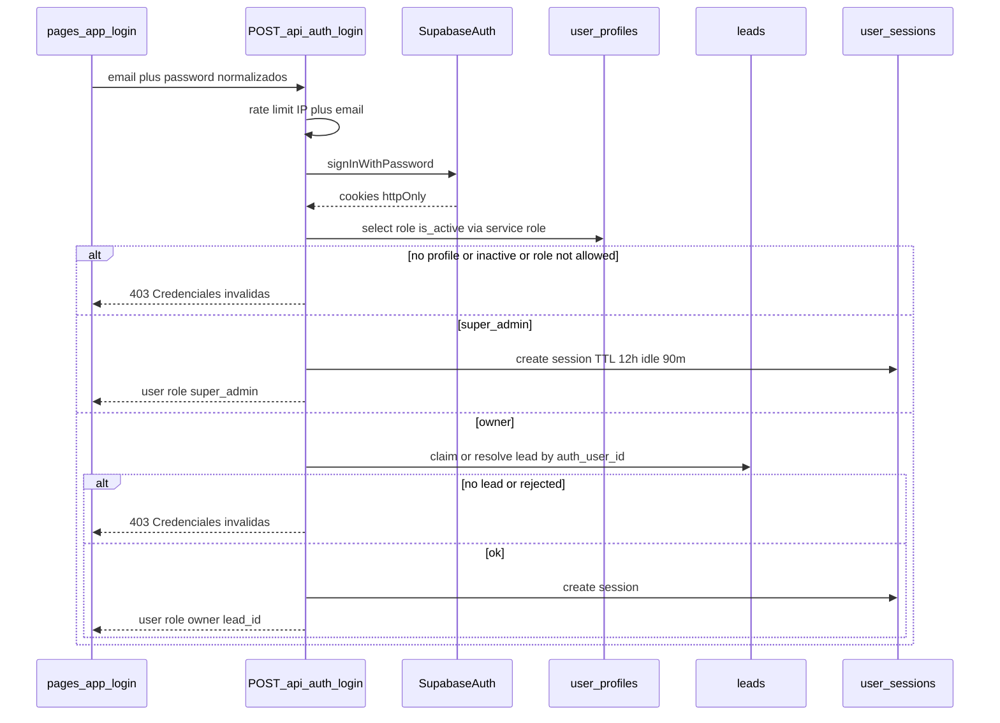

# Login unificado Webycitas (superadmin + clientes)

Target: https://webycitas.humanosisu.net/

Un form, un endpoint. La separación es `user_profiles.role` + `leads.auth_user_id`.

Mercado (host, HMAC, locatarios, repo `mercado-san-pablo`) queda fuera de este plan.

## Estado actual

- Operador Webycitas: HMAC + env (`WEBYCITAS_ADMIN_*`, cookie `webycitas_ops`). UI: `pages/admin/login.tsx` → `POST /api/admin/ops/login`.
- Panel cliente: schema y guards ya existen. Falta UI de login y endpoint.
  - Tenant = `leads.id` vía `leads.auth_user_id` (`supabase/migrations/20260929170000_client_suite.sql`).
  - `lib/suite/tenant.ts` ya define `SUITE_LOGIN_PATH = '/app/login'` y `requireSuitePage`.
  - No hay `pages/app/login.tsx` ni `pages/app/index.tsx`.
- Supabase propio (`cthzofskbfpcgapdauac`). Cookies de host (sin `Domain=.humanosisu.net`). No comparte sesión con Planilla.

Referencia de contrato (no de tenant): login de Planilla / Humano SISU. Un form, un endpoint, split por `user_profiles.role`. Cookies httpOnly + `setSession`. `autoRefreshToken: false`. Idle 90 min / TTL 12 h.

## Modelo

| Capa | Fuente | Qué decide |
| --- | --- | --- |
| Autenticación | Supabase Auth de webycitas (`auth.users`) | Email + password, JWT, cookies |
| Autorización | `public.user_profiles` | `role`, `is_active` |
| Tenant cliente | `public.leads.auth_user_id` | Un lead por usuario. `current_lead_id()` ya existe |

Roles que entran (`canLoginToApp`):

- `super_admin` — operador de Webycitas. Sin `lead_id`. Reemplaza el HMAC `WEBYCITAS_ADMIN_*`.
- `owner` — dueño de site. Requiere lead no `rejected` ligado a `auth.users.id`.

No copiar roles de HR (`hr_manager`, `company_admin`, `employee`). No copiar `company_id`.



## Entrada y redirección

Canónico: `/app/login` (ya lo espera `requireSuitePage`).

- `/admin/login` → 301 a `/app/login?redirect=/admin`.
- Recuperación: `/app/forgot-password` → `POST /api/auth/forgot-password` → `/auth/update-password?next=/app/login`.
- Un solo form. Título: “Iniciar sesión”. No “Operador”.

Post-login:

```
super_admin + redirect /admin*     → ese redirect
super_admin                        → /admin
owner                              → /app
```

Este login solo cubre `webycitas.humanosisu.net`.

## Login (paridad con el contrato de Planilla)

1. Cliente: `trim` + minúsculas en email; quitar whitespace invisible de password.
2. `POST /api/auth/login`.
3. Rate limit: reutilizar `lib/rate-limit.ts`. 8 / 15 min por IP+email; 40 / 15 min por IP.
4. `createSuiteServerClient` + `signInWithPassword` → cookies `sb-*-auth-token` (1 día, `Secure` en prod, `SameSite=lax`). Ya está en `lib/suite/supabase-server.ts`.
5. Perfil con service role. Sin fila / `is_active=false` / rol no permitido → 403 “Credenciales inválidas”.
6. Owner: si `leads.auth_user_id` es null y existe lead con el mismo email y `status <> rejected`, claim (`auth_user_id` + `claimed_at`). Si no hay lead → 403 genérico.
7. Fila en `user_sessions` (TTL 12 h, idle 90 min, hashes IP/UA).
8. Respuesta: `user` (`role`, `lead_id` o null), `session`, `userProfile`.
9. Browser: `localStorage.user` + `supabase.auth.setSession`. `autoRefreshToken: false`.

## Cómo se separa superadmin

**UI.** `/admin/*` deja de usar `requireOpsAdminPage` (HMAC). Nuevo `requireSuperAdminPage` / `SuperAdminGuard`: sin sesión → `/app/login?redirect=...`; sesión con rol ≠ `super_admin` → `/app`. Eso es UX.

**API.** `/api/admin/ops/*` deja `requireOpsAdminApi`. Nuevo `requireSuperAdmin` (`allowedRoles: ['super_admin']`): JWT cookies primero, Bearer fallback, perfil via admin client, `is_active`. Audit: IP, UA, acción.

**Datos.** Owner: RLS + `current_lead_id()` (ya escrito). Superadmin: service role en APIs de ops (como hoy). Un filtro de lead no aplica si `role === 'super_admin'`.

**Sesión.** Cookies primero. Perfil siempre con admin client.

## Sesión viva

- Heartbeat `POST /api/auth/heartbeat` → `last_activity`.
- Idle ≥ 90 min → 401/440 → `/app/login`.
- Aviso en rutas `/app` y `/admin` (excepto login).
- Logout: borra `localStorage.user` + `signOut()` + cookie HMAC vieja si aún existe (periodo de corte).

## Alta de password del owner

El magnet solo guarda email en `leads`.

- Superadmin en `/admin` dispara invite: `auth.admin.generateLink` / `inviteUserByEmail` con `redirectTo=/auth/update-password?next=/app/login`.
- Alternativa del owner: forgot-password si el auth user ya existe.
- Primer login con el email del lead hace el claim.

## Schema (proyecto Supabase webycitas)

Migración nueva. No tocar Planilla.

`user_profiles`:

- `id` PK → `auth.users(id)` ON DELETE CASCADE
- `role` text check (`super_admin`, `owner`)
- `is_active` bool default true
- `permissions` jsonb default `{}`
- timestamps

`user_sessions` + RPCs `create_user_session` / `update_session_activity`.

RLS: el usuario lee su fila; writes solo service role.

Seed del primer `super_admin`: script con service role (email/password por env, nunca en el repo). Tras verificar login, borrar `WEBYCITAS_ADMIN_EMAIL` / `WEBYCITAS_ADMIN_PASSWORD` / `WEBYCITAS_ADMIN_SESSION_SECRET` del servicio Railway.

## Archivos

Nuevos:

- `pages/app/login.tsx`
- `pages/app/forgot-password.tsx`
- `pages/auth/update-password.tsx`
- `pages/app/index.tsx` — destino owner (stub si `/app/sitio` aún no existe)
- `pages/api/auth/login.ts`
- `pages/api/auth/forgot-password.ts`
- `pages/api/auth/logout.ts`
- `pages/api/auth/heartbeat.ts`
- `lib/auth/role-access.ts`
- `lib/auth/api-auth.ts`
- `lib/auth/session-manager.ts`
- `lib/supabase/browser.ts` — `autoRefreshToken: false`, `persistSession: true`
- `supabase/migrations/YYYYMMDDHHMMSS_user_profiles_sessions.sql`
- `scripts/seed-super-admin.ts`

Cambios:

- `pages/admin/login.tsx` → redirect a `/app/login?redirect=/admin`
- `lib/ops/admin-auth.ts` + APIs `/api/admin/ops/*` → `requireSuperAdmin`
- `pages/_app.tsx` — providers + warning de idle en `/app` y `/admin`
- `.env.example` — quitar trio HMAC de Webycitas
- `README.md` — contrato de login

Fuera de alcance:

- Mercado (host, HMAC, locatarios, extracción de repo)
- Compartir Auth/cookies con `humanosisu.net` (Planilla)
- Constructor completo `/app/sitio` / reservas / inventario (solo home stub + auth)

## Corte HMAC Webycitas

1. Migración + seed super_admin.
2. Login nuevo en verde (ops + un lead de prueba).
3. Redirect de `/admin/login`.
4. APIs ops leen JWT, no cookie `webycitas_ops`.
5. Quitar env HMAC de Webycitas. Cookie `webycitas_ops` Max-Age=0 en logout.

## Todos de implementación

- [ ] Migración `user_profiles` + `user_sessions` + RPCs
- [ ] `POST /api/auth/login` (rate limit, signInWithPassword, gate por role, claim de lead, user_sessions)
- [ ] `pages/app/login.tsx` + forgot-password + update-password; `/admin/login` redirige
- [ ] `requireSuperAdmin` en APIs `/admin/ops`; `requireSuitePage` para `/app`; logout + heartbeat
- [ ] Script seed super_admin; home stub `/app`; README y env; retiro HMAC Webycitas
